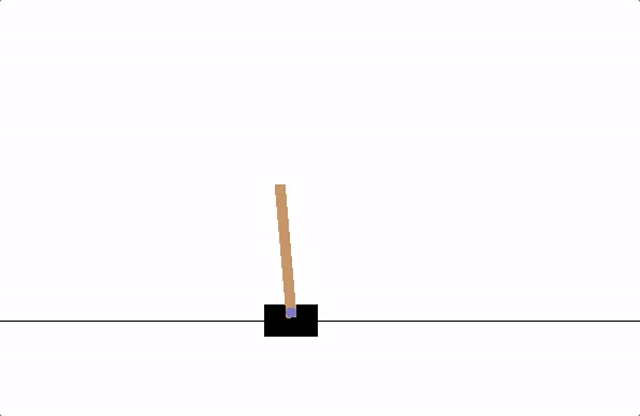

# NeuroGym

NeuroGym is a submodule of [RubikNet](https://github.com/badboy1606/RubikNet) containing foundational experiments in **Reinforcement Learning** and **Deep Learning**.

  

---

## Reinforcement Learning

Experiments with **RL agents** trained on classic control environments:

| Environment | Description |
|---|---|
| **CartPole** | Balancing a pole on a cart |
| **Taxi** | Navigating a taxi to pick up and drop passengers |
| **MountainCar** | Driving a car up a steep hill with limited power |
| **Blackjack** | Learning strategies using Monte Carlo methods |

These experiments build the foundation for applying RL to more complex tasks like solving the Rubik's Cube.

---

## Deep Learning

An introduction to deep learning fundamentals:

- Basics of **neural networks** and how they learn
- Hands-on project: **Fashion Classification (Fashion-MNIST)**

Helps build the foundation needed before moving on to Reinforcement Learning and Cube Solvers.